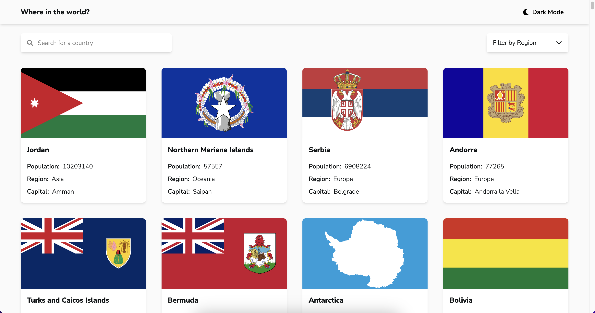
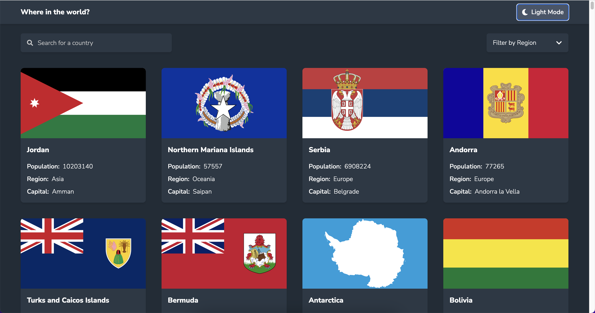
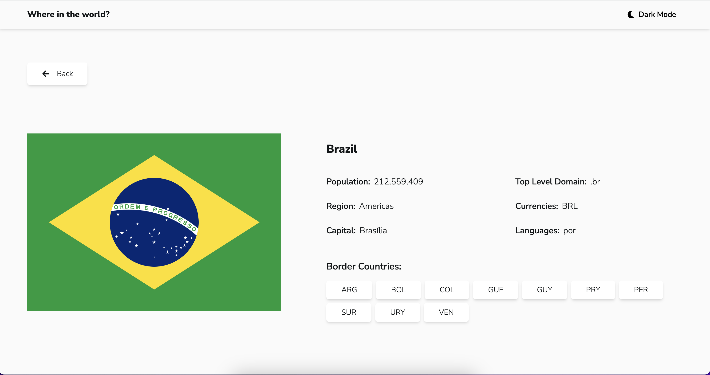
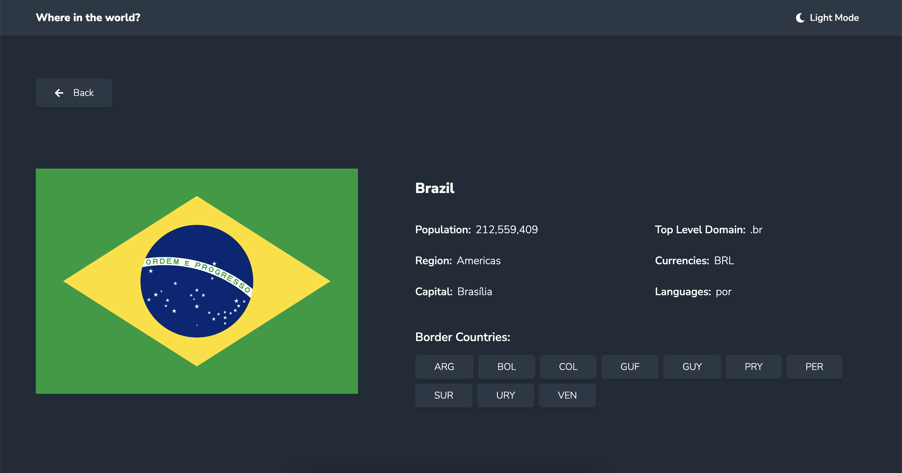
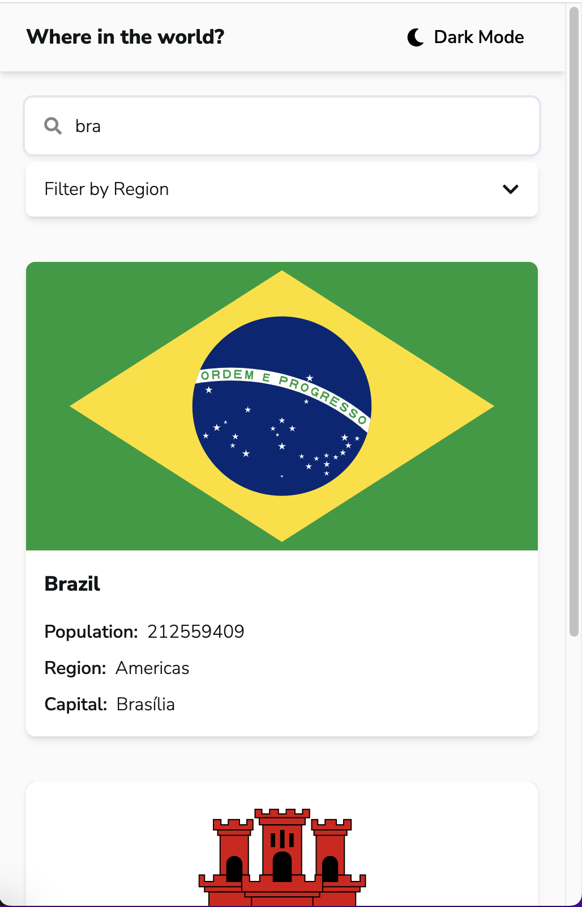
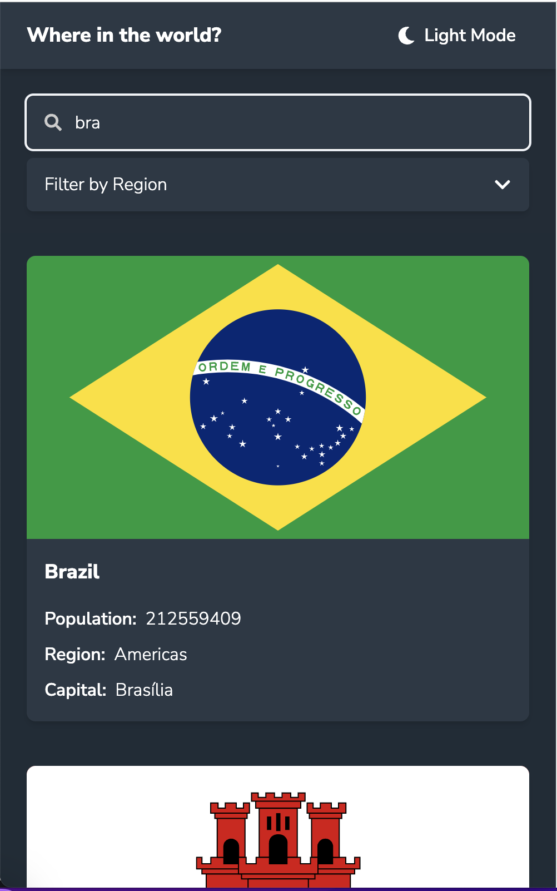
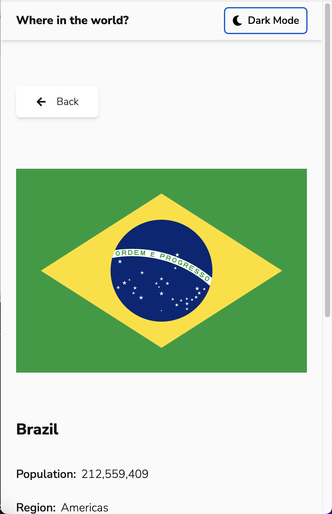
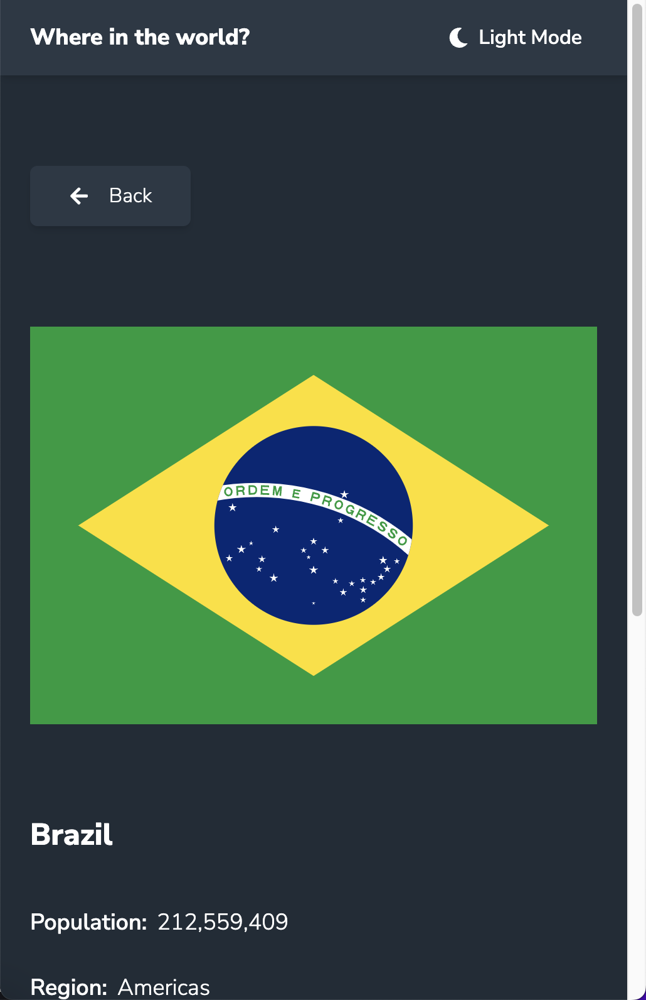

# Frontend Mentor - REST Countries API with color theme switcher solution

This is a solution to the [REST Countries API with color theme switcher challenge on Frontend Mentor](https://www.frontendmentor.io/challenges/rest-countries-api-with-color-theme-switcher-5cacc469fec04111f7b848ca). Frontend Mentor challenges help you improve your coding skills by building realistic projects.

## Table of contents

- [Overview](#overview)
  - [The challenge](#the-challenge)
  - [Screenshot](#screenshot)
  - [Links](#links)
- [My process](#my-process)
  - [Built with](#built-with)
- [Author](#author)
- [Acknowledgments](#acknowledgments)

## Overview
Project to list countries of the world with details about population, capital, regions and more

### The challenge

Users should be able to:

- See all countries from the API on the homepage
- Search for a country using an `input` field
- Filter countries by region
- Click on a country to see more detailed information on a separate page
- Click through to the border countries on the detail page
- Toggle the color scheme between light and dark mode _(optional)_

### Screenshot

#### Desktop

#### Mobile

### Links

- Solution URL: [Add solution URL here](https://your-solution-url.com)
- Live Site URL: [Add live site URL here](https://your-live-site-url.com)

## My process
First of all, I wanted to develop all the aesthetics of the project, such as layout and colors. Gradually I installed dependencies such as routing and icons. For the development I used a mock to adjust the expectations of the design. At the end of it all, I installed data fetching and caching libraries for a better experience.
### Built with

- [Mobile-first workflow](https://smartbear.com/learn/performance-monitoring/what-is-mobile-first/)
- [Tailwindcss](https://tailwindcss.com/)
- [React](https://react.dev/)
- [TanStack Query](https://tanstack.com/query/latest)
- [Axios](https://axios-http.com/docs/intro)
- [RadixUI - Dropdown](https://www.radix-ui.com/docs/primitives/components/dropdown-menu)
- [usehooks-ts](https://usehooks-ts.com/)
- [TypeScript](https://www.typescriptlang.org/)
- [react-icons](react-icons)
- [React Router Dom](https://reactrouter.com/en/main)

## Author

- Website - [Alex Alan Nunes](https://alexalannunes.vercel.app/)
- Frontend Mentor - [@alexalannunes](https://www.frontendmentor.io/profile/alexalannunes)
- Twitter - [@alexalannunes](https://www.twitter.com/alexalannunes)

## Acknowledgments

In this project I have been using atomic commits together with eslint, conventional-commits and commitzen

